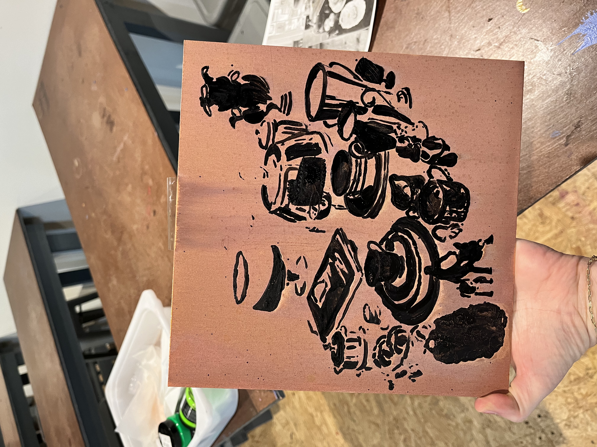

And as for hobbies... 

When I can spare the time I love printmaking! Screenprinting, copperplate etching with aquatint, linocut, and letterpress. The more manual and tedious the better. 

I also enjoy painting cozy scenes which have robots in them. 

For example, this robot is attending a zoom meeting and examining a bar chart: 

My printmaking and art-website are mainly on hiatus while I am finishing up my dissertation. Stay tuned!

